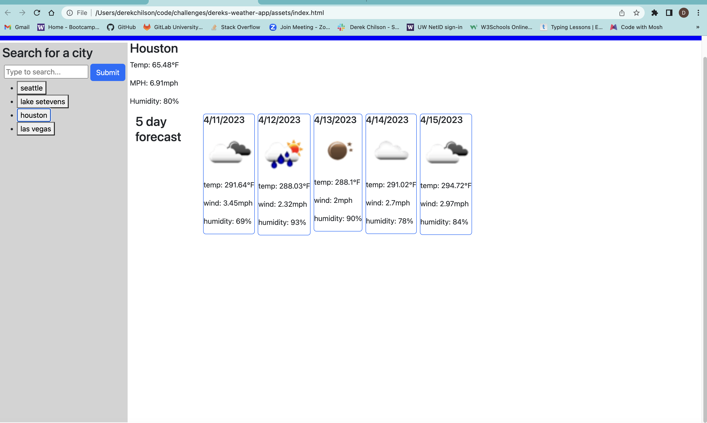

# dereks-weather-app

## Description
This is a weather page that you can search the weather and it gives you current and a five day outlook. It is using a weather api to get the information that will display from the search of the city. I used a basic htnl and css to get the layout, was more concerned with making it functionable then pretty. When I have time I will add some styling to the html. I had help from my tutor Andres, he helped me get the local storage and rendering the results so it can be retrieved on pge load. 
I learned a lot on how to use the api with dom manipulation to get results. I learned more about Jquery and how to implament the changes. I had to get a key for the weather api, also had to use to fetch command for both the api's. One was for the current weather and the one was for the extended forecast.

## Usage
When the page loads you simply enter a city and click search, it will give you current and extended weather for that city. If you enter a new city it will save all the searches and you can access them again.

## Screenshot
The first screenshot is showing the result of when I loaded the page showing the last serached city. The second one is showing after I clicked on Houston it then displays the same for that city.

Heres a link to the gitHub pages for this project: https://derekchili.github.io/dereks-weather-app/

## Credits
I used google and Jqueryui a lot to get the correct wording to use on this project. Had help from Andres the tutor to get some things working right. Also refrenced the previous lessons in the UW folder to get functions and loops done right.

